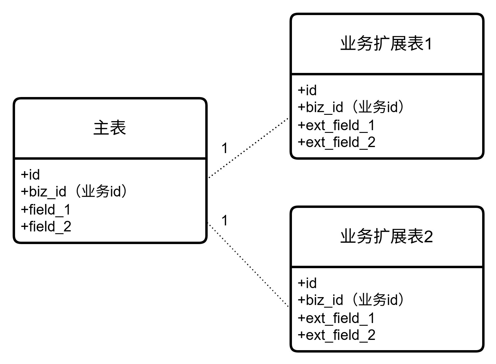
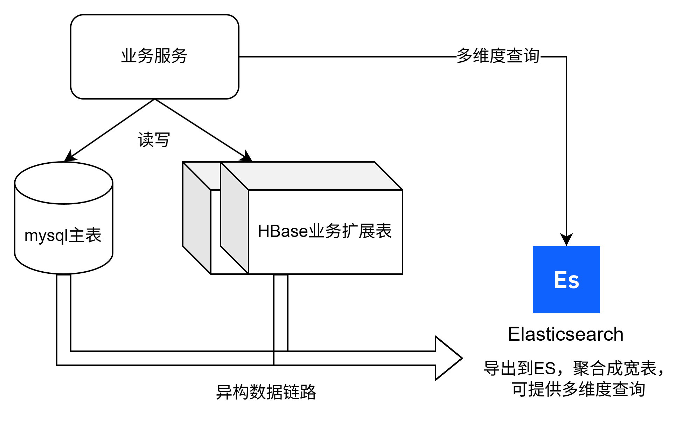

业务发展过程中，增加字段是很常见、频繁的，因此怎么存储新增的字段是要重点考虑的因素。下面结合笔者的经验，总结一下各种业务扩展模式选型的优缺点、适用场景，如何让系统保持良好的业务扩展性。

# 方案选项

## 1. 最朴素方案：MySQL表直接加字段

- 实现：
  在表中新增字段（`ALTER TABLE ... ADD COLUMN ...`）。

- 优点：
  
  - 简单直接，快速迭代

- 缺点：
  
  - 需要频繁修改表结构
  - 字段膨胀导致表臃肿，索引效率下降（mysql单行记录有大小上限，65535字节；特别地，TEXT、BLOB另外分开存储，占9到12字节）

- 适用场景：
  
  - 业务初期频繁加字段
  - 或该字段为通用字段，适用于所有记录

## 2. 按业务领域聚合字段（增量更新）

- 实现：
  将新增字段按业务域划分，比如业务一的信息都放到field_1，业务二的信息都放到field_2，每个字段是json格式、方便后续扩展。

- 优点：
  
  - 业务聚合：相同业务领域信息存在一个字段内，无需每次DDL新增字段

- 缺点：
  
  - 每次更新都要先查DB的值，merge本次变更后再写入DB
  - 需做好并发控制，否则可能丢失变更内容（可通过乐观锁、或悲观锁控制，取决于并发程度）
  - 仍然存在mysql单行大小限制

- 适用场景：
  
  - 小型项目，不做推荐

## 3. 按业务领域垂直拆表

- 实现：
  相近业务领域的字段，做垂直分表（如拆为订单信息表order_info、订单支付表order_payment、订单物流表order_logistics）。
  

- 优点：
  
  - 彻底解耦业务域，各表独立演进
  - 按需查表，提升查询性能

- 缺点：
  
  - 每个垂直分表仍是在表内新增字段
  - 业务扩展的难易程度，取决于垂直拆分得是否合理

- 适用场景：
  
  - 业务模式已经稳定
  - 或业务边界清晰的项目

## 4. 主表 + 动态扩展表（通过业务ID关联）

- 实现：
  主表：存储核心字段（如业务ID、其它通用关键字段）
  动态扩展表：存储动态扩展字段，与主表通过业务id关联。包括扩展key、扩展value（可以是json格式，方便后续扩展）
  每次新增字段：(1）新增一个扩展key，在扩展value里存储内容；(2）或在已有扩展key的value中新增字段。
  

之所以通过动态扩展表来实现，是因为很多字段并非通用的，而仅针对部分记录。

以电子产品为例：
可以有扩展字段1（认证证书：3C），则扩展key为"certification"，value是`["3C"]`
也可以有扩展字段2（保修信息：保修期12个月、可延保、最长可延保24个月），则扩展key为"warranty"，value是`{"warrantyMonths": 12, "canExtend": true, "maxWarrantyMonths": 24}`
以食品为例：
可以有扩展字段1（保质期截止时间：2026-07-07），则扩展key为"bestBefore"，value是对应时间戳
也可以有扩展字段2（生产地：中国上海），则扩展key为"productionPlace"，value是`{"country": "CN", "province": "Shanghai"}`

表结构设计：

```sql
-- 主表
CREATE TABLE biz_info (
  id BIGINT AUTO_INCREMENT PRIMARY KEY,
  biz_id BIGINT UNIQUE KEY,  -- 业务ID
  ...  -- 其它通用关键字段
);

-- 通用扩展表
CREATE TABLE biz_extension (
  id BIGINT AUTO_INCREMENT PRIMARY KEY,
  biz_id BIGINT,        -- 关联主表的业务ID
  extension_key VARCHAR(64), -- 扩展key名
  extension_value TEXT,      -- 扩展value值
  UNIQUE KEY (biz_id, extension_key) -- 唯一键
);
```

- 优点：
  
  - 动态扩展字段，无需DDL变更
  - 按需查扩展key对应的记录，提升查询性能

- 缺点：
  
  - 扩展数据为字符串存储，需要按业务自定义格式解析，无法直接按条件筛选查询

- 适用场景：
  
  - 应当优先考虑的长期方案

## 5. MySQL主表 + HBase业务扩展表

- 实现：
  MySQL：存储核心结构化数据（强事务需求、可指定条件筛选查询）
  HBase：存储动态扩展字段（稀疏、多列），可以按业务领域垂直拆表，因为在HBase表中新增字段的成本很低
  关联方式：用mysql主表业务ID，作为HBase rowKey的一部分，通过业务id即可查到HBase中的其它扩展信息。
  如果想按条件查询扩展信息，需要把数据导入到ES里，通过ES查询。
  

HBase表设计：
如果业务id是123456789，则rowKey可设计成：{业务id后缀}_{业务id}，如789_123456789；方便将hbase数据打散到不同的region，提高存储和查询性能。

HBase业务扩展表1

| rowKey    | 字段1          | 字段2              | 字段3 |
| --------- | ------------ | ---------------- | --- |
| rowKey100 | cf1:cert=xxx | cf1:warranty=yyy | ... |

HBase业务扩展表2

| rowKey    | 字段1                 | 字段2          | 字段3 |
| --------- | ------------------- | ------------ | --- |
| rowKey200 | cf2:best_before=aaa | cf2:prod=bbb | ... |

- 优点：
  
  - 支持大量列字段，稀疏存储高效
  - 是“主表 + 扩展表”的进阶版

- 缺点：
  
  - 扩展信息不能方便地按条件查询，导出至ES后才行
  - 事务支持弱（跨 MySQL/HBase 无法保证事务性，只能做到最终一致性）
  - 复杂度变高：开发成本、运维成本都变高了

- 适用场景：
  
  - 数据量较大，需拆分一部分扩展信息至HBase
  - 或动态扩展字段变多，达到千级/万级时

# 结论

- 适用于所有记录的字段，在MySQL表中直接新增
- 初期优先选择“主表 + 动态扩展表”模式，平衡灵活性与复杂度
- 当扩展信息数据量较大，或动态扩展字段达到千级/万级时，考虑升级到“MySQL主表 + HBase业务扩展表”模式
- 若需复杂查询，可补充 Elasticsearch 构建二级索引
