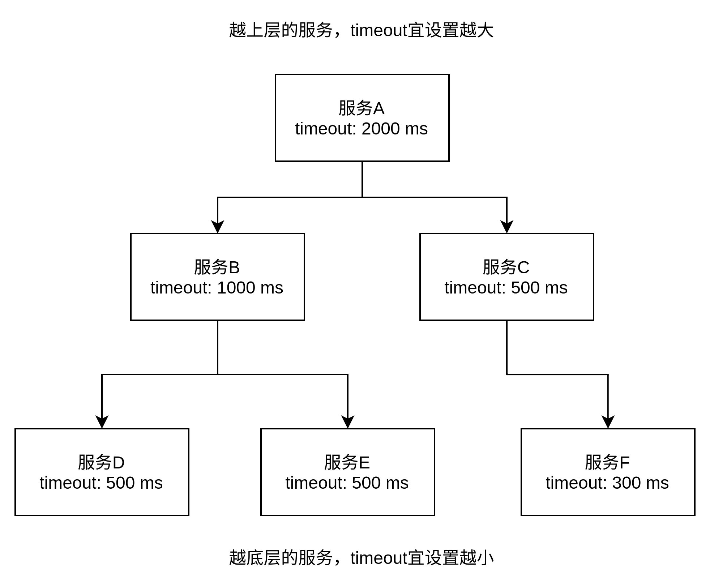
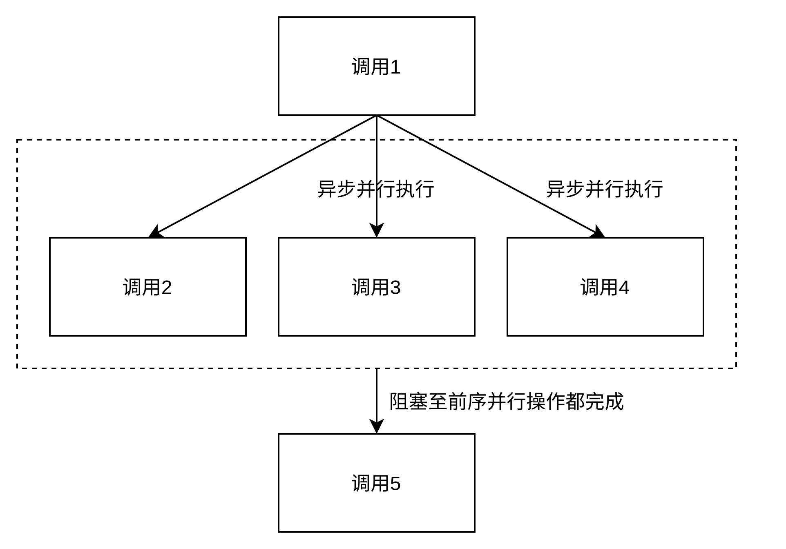
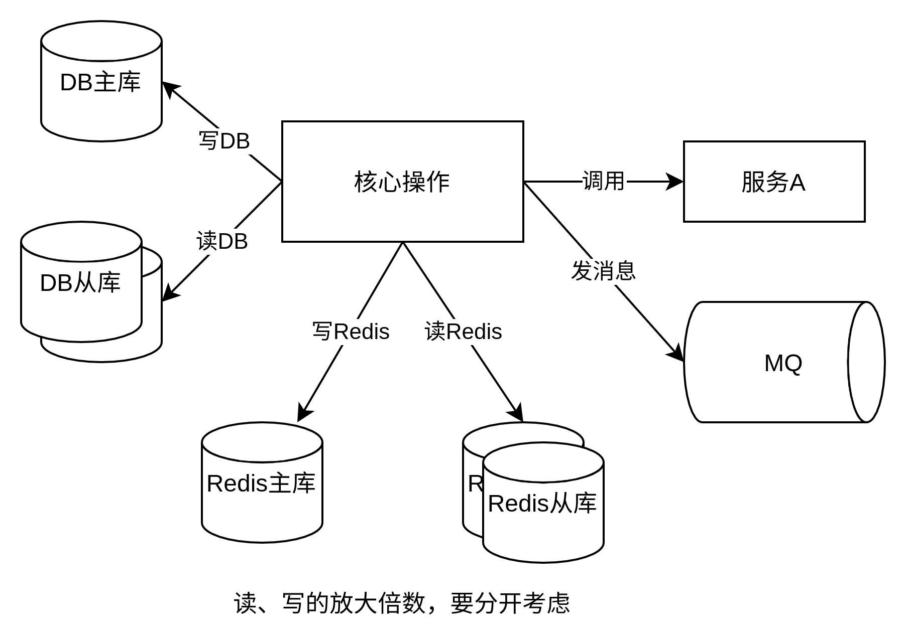

为了构建高并发、高可用的系统架构，压测、容量预估必不可少，在发现系统瓶颈后，需要有针对性地扩容、优化。结合楼主的经验和知识，本文做一个简单的总结，欢迎探讨。

# 1、QPS保障目标

一开始就要明确定义QPS保障目标，以此来推算所需的服务、存储资源。可根据历史同期QPS，或者平时峰值的2到3倍估算。

压测目标示例：

* qps达到多少时，服务的负载正常，如平均响应时间、95分位响应时间、cpu使用率、内存使用率、消费延迟低于多少
* 不要让任何一个环节成为瓶颈，需考虑服务实例、数据库、Redis、ES、Hbase等资源

# 2、服务注意点

## 2.1、服务qps上限

服务qps上限 = 工作线程数 * 1/平均单次请求处理耗时

主要关注以下几点：

### （1）工作线程数，对qps起到了直接影响。

dubbo工作线程数配置举例：
`<dubbo:protocol name="dubbo" threadpool="fixed" threads="1000" />`

### （2）cpu使用率：跟服务是I/O密集型，还是计算密集型有关。

* I/O密集型：调用多个下游服务，本身逻辑较简单，cpu使用率不会很高，因此服务实例的个数不用很多
* 计算密集型：本身逻辑很复杂，有较重的计算，cpu使用率可能飙升，因此可适当多部署一些服务实例

### （3）网络带宽：

* 对于大量的小请求，基本无需考虑
* 如果请求内容较大，多个并发可能打满网络带宽，如上传图片、视频等。

以实际压测为准。或者在线上调整权重，引导较多流量访问1台实例，记录达到阈值时的qps，可估算出单实例的最大qps。

## 2.2、超时时间设置



**漏斗型**：从上到下，timeout时间建议由大到小设置，也即底层/下游服务的timeout时间不宜设置太大；否则可能出现底层/下游服务线程池耗尽、然后拒绝请求的问题（抛出java.util.concurrent.RejectedExecutionException异常）
原因是上游服务已经timeout了，而底层/下游服务仍在执行，上游请求源源不断打到底层/下游服务，直至线程池耗尽、新请求被拒绝，最坏的情况是产生级联的雪崩，上游服务也耗尽线程池，无法响应新请求。
具体timeout时间，取决于接口的响应时间，可参考95分位、或99分位的响应时间，略微大一些。
dubbo超时时间示例：在服务端、客户端均可设置，推荐在服务端设置默认超时时间，客户端也可覆盖超时时间；
`<dubbo:service id="xxxService" interface="com.xxx.xxxService" timeout=1000 />`
`<dubbo:reference id="xxxService" interface="com.xxx.xxxService" timeout=500 />`

## 2.3、异步并行调用



如果多个调用之间，没有顺序依赖关系，为了提高性能，可考虑异步并行调用。
dubbo异步调用示例：

1. 首先，需要配置consumer.xml，指定接口是异步调用：
   `<dubbo:reference id="xxxService" interface="com.xxx.xxxService" async=true />`

2. 然后，在代码中通过RpcContext.getContext().getFuture()获取异步调用结果Future对象：
   
   ```java
       // 调用1先执行
    interface1.xxx();
   
    // 调用2、3、4无顺序依赖，可异步并行执行
    interface2.xxx();
    future2 = RpcContext.getContext().getFuture();
    interface3.xxx();
    future3 = RpcContext.getContext().getFuture();
    interface4.xxx();
    future4 = RpcContext.getContext().getFuture();
   
    // 获取调用2、3、4的执行结果
    result2 = future2.get();
    result3 = future3.get();
    result4 = future4.get();
    // 此处会阻塞至调用2、3、4都执行完成，取决于执行时间最长的那个
    handleResult2(result2);
    handleResult3(result3);
    handleResult4(result4);
   
    // 调用5最后执行，会阻塞至前序操作都完成
    interface5.xxx();
   ```

## 2.4、强依赖、弱依赖

* 强依赖调用：决不能跳过，失败则抛异常、快速失败
* 弱依赖调用：决不能阻塞流程，失败可忽略

## 2.5 降级

* 粗粒度：开关控制，如对整个非关键功能降级，隐藏入口
* 细粒度：调用下游接口失败时，返回默认值

## 2.6 限流

超过的部分直接抛限流异常，万不得已为之。

# 3、存储资源注意点

## 3.1、放大倍数：1次核心操作，对应的资源读写次数、接口调用次数



例如：1次核心操作，查了3次缓存、写了1次缓存、查了2次数据库、写了1次数据库、发了1次MQ消息、调了下游服务A的接口；

则对于读缓存放大倍数为3，写缓存放大倍数为1，读数据库放大倍数为2，写数据库放大倍数为1，MQ放大倍数为1，调用下游服务A的放大倍数为1。针对写放大倍数，需要单独考虑主库是否扛得住放大倍数的qps。
需关注：

* 读、写的放大倍数，要分开考虑，因为分布式架构通常是一主多从，一主需要支撑所有的写QPS，多从可以支撑所有的读QPS
* DB读放大倍数、DB写放大倍数
* Redis读放大倍数、Redis写放大倍数
* MQ放大倍数
* 接口调用放大倍数等

## 3.2、存储资源QPS估算

存储资源的QPS上限，跟机器的具体配置有关，8C32G机型的QPS上限当然要高于4C16G机型。下表为典型值举例。

| 资源类型  | 单实例QPS数量级（典型值） | 水平扩展方式                      | 集群总QPS估算                                      |
| ----- | -------------- | --------------------------- | --------------------------------------------- |
| DB    | 几千             | 分库分表                        | 实例个数*单实例QPS，其中实例个数的范围是1~分库个数（可达数百）            |
| Redis | 几万             | Redis集群                     | 实例个数*单实例QPS，其中实例个数的范围是1~分片个数（可达数百），总QPS可达百万级  |
| MQ    | 几万             | partition拆分，每个分片最多被1个服务并发消费 | 实例个数*单实例QPS，其中实例个数的范围是1~partition个数，总QPS可达百万级 |
| HBase | 几千？            | region拆分                    | 实例个数*单实例QPS，其中实例个数的范围是1~region个数              |
| ES    | 几千？            | shard拆分                     | 实例个数*单实例QPS，其中实例个数的范围是1~shard个数               |
