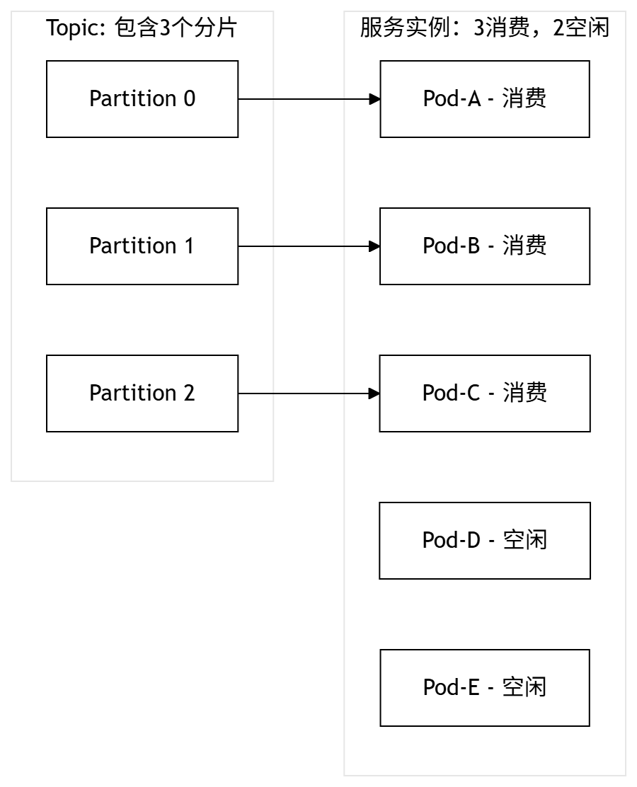

大家好，我是Java烘焙师。本次分享一下CPU使用率不均匀的排查过程，先看问题现象，再找问题根因、解决办法，最后扩展到通用的排查思路、典型原因。
先说结论，根因是服务实例数大于kafka分片数。快速的解决办法是扩大kafka分片数，彻底方案是拆成2个服务（消费任务服务、业务API服务）。除了这个原因，其它典型的原因比如入口负载不均匀、存在热点、线程阻塞等待、线程池大小不够、GC耗时变长等，日常积累加入到经验池。下面详细展开介绍。

# 1. 现象

* 线上服务有多个实例，从监控看CPU使用率不均匀，部分实例稳定偏高，而不是个别实例有CPU尖刺
* 重启服务实例后，仍然无法消除，但是过一段时间后，又恢复均匀了

# 2. 根因定位

既然是部分实例有问题，那关键就要找出异常实例与正常实例的差异，首先确认负载是否均衡。

* 先看接口qps，没有明显差异
* 再看kafka消费qps，果然有差异：CPU使用率高的实例，有消费消息，消费qps较高；而其它正常实例，无消费

那么，问题就清楚了：

* 一个kafka topic由多个分片组成，每个分片只能被一个服务实例消费
* 当服务实例数大于kafka分片数时，只有部分服务实例能分到partition，消费消息并处理业务逻辑，CPU使用率偏高，其它未分配到的实例则相对空闲
* 当kafka topic不再产生新消息，并且消息都消费完毕后，各服务实例的CPU使用率就恢复均匀了

回顾一下历史上做的变更：

* 一开始接口qps不高，部署的服务实例数不多（比如10个）
* 后续又新增了消费逻辑，每天离线导出数据、并消费处理，相当于定时消费任务，申请的kafka topic分片数等于服务实例数（也是10个），此时还察觉不出来CPU使用率的差异
* 随着业务流量持续增加，服务实例扩容（比如100个），此时问题就凸显了

# 3. 解决方案

## 快速方案：扩大kafka分片数

优点：快速解决问题
缺点：只对增量消息起作用，已发到topic里的消息，是改不了partition编号的；长期看，kafka分片数无法与服务实例数联动增长

## 彻底方案：拆分消费任务服务、业务API服务

优点：彻底解决问题，消费任务服务实例数相对固定（比如n个），可以按倍数申请kafka分片数（比如2n个），使得每个消费服务实例分到均匀的kafka分片。业务API服务，可以随着流量变化灵活调整，动态扩容、缩容。

# 4. kafka核心概念回顾

下面再回顾一下kafka核心概念。

## topic（消息队列）与partition（分片）

topic是消息的逻辑队列，每个topic被划分为多个partition，它是物理存储与并行消费的最小单位。一个topic的消费处理上限，取决于partition个数，partition越多，并发度就越大。
一个partition内的消息严格有序，不同partition之间无序。生产者可通过消息key（一般是业务id）将消息发送至指定的partition，来实现同一业务id的消息有序性。

## consumer group（消费组）与rebalance（再平衡）

consumer group是一组协同消费的消费者实例。核心规则：同一个partition在同一时刻只能被group内的一个消费者实例消费。
rebalance：当消费者增减或partition数量变化时，partition会在消费者间重新分配。

## offset（消费位点）与超时风险

每个partition的offset由consumer group独立管理。
如果单条消息处理时间超过`max.poll.interval.ms`（默认5分钟），消费者会被踢出消费组，触发rebalance，进一步恶化性能。

# 5. CPU使用率不均匀的排查思路、典型原因

面对CPU使用率不均匀的问题，最高效的排查思路是：固定时间窗口（如最近5分钟），拉取所有问题实例的监控指标进行横向对比。差异点，就是线索。

## 第一步：对比请求量

首先确认负载是否均衡、请求是否真的打进来了。
确认接口qps、消息消费qps、是否有热点，类似于本文提到的排查步骤。除了上面的kafka分片数问题，以下原因都可能导致负载不均匀：

* 生产者消息key严重倾斜：热点key导致全部落入同一partition
* 上游负载均衡策略失效，或RPC一致性哈希倾斜

## 第二步：对比线程状态

在流量一致的前提下，如果CPU不同，则继续重点关注线程状态，以下原因可能导致CPU使用率飙升：

* RPC线程池/业务自定义线程池/数据库连接池，因大小不够而耗尽
* 调存储、调下游超时时间设置不合理，导致阻塞线程数变多
* CAS乐观锁并发较高，导致不停自旋、无法更新
* 死锁

## 第三步：对比GC状态

如果线程状态无异常，则继续排查GC状态。

* 对比GC是否变慢、GC频率是否变多，是否有大对象，堆内存大小是否足够
* 确认JVM参数，是否设置合理

## 第四步：重启服务

如果实在没有思路，又想快速恢复，可以尝试重启服务，说不定是底层k8s容器、或宿主机的问题，可以说是终极大法了。

# 6. 总结

* 架构设计要合理，消费任务、在线业务逻辑，要拆分到不同的服务
* 监控要完善，在遇到CPU使用率不均匀问题时的排查思路是找差异
* 按照几步来定位根因：对比请求量、对比线程状态、对比GC状态、重启服务