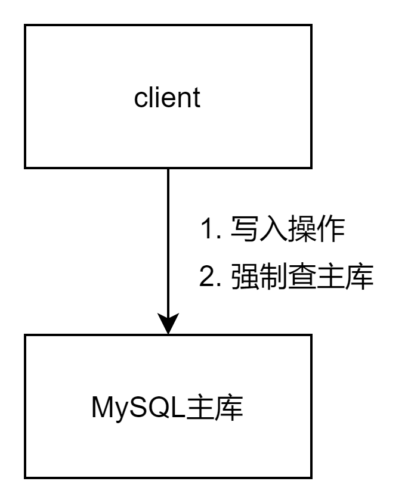
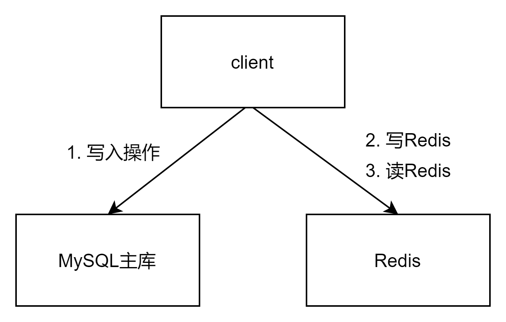

上一篇文章介绍了[MySQL主从同步的原理和应用](https://www.cnblogs.com/toplist/p/15365460.html)，本文总结了MySQL主从延迟的原因和解决办法。如果主从延迟过大，会影响到业务，应当采用合适的解决方案。

# MySQL主从延迟的表现

先insert或update写入更新操作，再立即select查询，但是得不到最新的结果。
可通过show slave status命令，结果中的Seconds_Behind_Master列，查看主从延迟的秒数。

# MySQL主从延迟的原因

1. 读写分离时，写操作走主库，读操作走从库，但是主库的变更还未同步至从库
2. 网络传输延迟：从库发起dump请求，主库推送binlog文件，从库写入本地relay log
3. 从库串行执行sql语句：主库并发的事务提交，但是在从库上只能串行执行，速度比主库慢

# MySQL主从延迟解决办法

## 业务优化

如果业务场景允许，先写入更新操作，等待一小段时间后再查询。比如，新增一条记录，前端故意延迟半秒再调后端接口查询。

## 技术优化

* 拆库+并行复制：MySQL支持库级别的并行复制，拆库后每个分库的数据量变小，主从延迟自然也变小了。

* 慢sql优化除慢sql，也能降低主从延迟
  
  ## 终结方案
  
  以上办法治标不治本，只能起到缓解主从延迟的作用，彻底根治还需这么做。
- 显式查主库：不同的分片中间件做法不一样，client侧分片可在每次查询前设置查主库的标记（ThreadLocal变量），proxy侧分片开启事务
  优点：实现简单，缺点：受MySQL QPS限制，QPS极高时不推荐
  

- 双写数据库和缓存，查缓存：避免MySQL主从延迟
  优点：可支撑高并发场景
  
