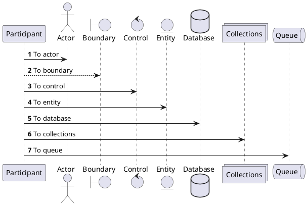

---
title: 后端程序员生产力工具合集
---

后端程序员除了写代码，也难免要写设计文档，画各种图。因此掌握各种生产力工具，是很有必要的，可以达到事半功倍的效果。
下面结合楼主亲身体验，推荐一些生产力工具，欢迎探讨和补充。

主要分成几大类：

* 画图
* 文档编辑
* 终端客户端

# 1、画图

## draw.io

draw.io是全能型画图工具，忘了ppt、visio之类的软件吧。它比ProcessOn更好的一点是注重隐私性，可以支持本地编辑文件，而不必同步云端。
可以画几种实用的图：

* 架构图
* 流程图
* 数据库E-R图
* UI原型图

本地编辑，从github下载drawio-desktop桌面软件：https://github.com/jgraph/drawio-desktop/releases
在线编辑地址：https://app.diagrams.net

创建图类型选择：

架构图示例：架构图可参考楼主之前写的文章[《应用开发中的存储架构进化史——从起步到起飞》](https://www.cnblogs.com/toplist/p/15341529.html)

UI原型图示例：

## uTools

uTools是一个工具集管理软件，可以扩展安装很多有用的小工具，对后端程序员比较有用的有：

* json格式化
* 2个文本diff比较
* 时间戳转换
* 截图识别其中的文字
* 备忘快贴，可在云端记录代码片段、备忘事项 

alt+空格，快速调出utools搜索框，然后输入关键字就能快速找到相应工具。比如：对应上述的关键字，分别是json、diff、timestamp、ocr、备忘，非常便捷。

官网地址：https://www.u.tools
下面是截图示例。

json格式化：

时间戳转换：

## PlantUML

手画UML时序图还是比较累的，尤其是要考虑是否对齐，直线是否水平的情况。plantUML可以把后端程序员解放出来。
只需要写一段类似代码的东西，然后就能生成规整的UML时序图。时序图语法，详见：https://plantuml.com/zh/sequence-diagram
也可以探索其他类型的UML图，但大都有更好的替代品。

示例代码：

通过命令行、或在线工具，可以生成UML时序图：

## Intellij IDEA

不必多说，Intellij IDEA是最好用的Java IDE，如果你还在用Eclipse，赶紧换了吧。
Python也有类似的Pycharm IDE，都是JetBrains公司做的，是开发Python的不错选择。
官网下载地址：https://www.jetbrains.com.cn/idea/download

最实用的功能，需要熟练掌握：

* 自动生成类图：在类文件上鼠标右键，选 Diagrams -> Show Diagram...
* 查找依赖：Find Usages
* 断点调试

类图示例：类图可参考楼主之前写的[《Spring cache源码分析》](https://www.cnblogs.com/toplist/p/16032955.html)

## xmind

用来画思维导图，记录灵感。
官网地址：https://www.xmind.cn

# 2、文档编辑

## mdnice

mdnice是一个微信公众号markdown排版工具，并且可以一键发布文章到多个平台，免费、省时省力。
如果你也是一个在多个平台上写技术文章的博主，mdnice就非常适用。

下载chrome插件地址：https://product.mdnice.com/membership/product

## typora

本地编辑和预览markdown文件，简洁明了。
typora中文站：https://typoraio.cn

## gitbook/mindoc

顾名思义，gitbook是通过git来实现电子书管理的工具，可以把文章组织成章节目录，就像一本电子书，使得博客/文档体系化。
当写了足够多的文章后，就可以分门别类地组织成一本电子书了。可以通过命令行工具，或在线编辑电子书。
gitbook官网地址：https://www.gitbook.com

gitbook示例：

mindoc是国人实现的在线文档管理系统，效果跟gitbook类似。
mindoc github地址：https://github.com/mindoc-org/mindoc

# 3、终端客户端

## MobaXterm

MobaXterm是PC端好看、好用的终端客户端，包含SSH、VNC、SFTP等客户端。如果你还在用putty、secureCRT这种界面简陋、功能单一的客户端，不妨换这个试试。比xmanager/xshell更好的点是免费。

## JuiceSSH

JuiceSSH是安卓手机上好用的SSH客户端，手机上也能敲命令，连接和控制服务器了。
官网地址：https://www.juicessh.com

